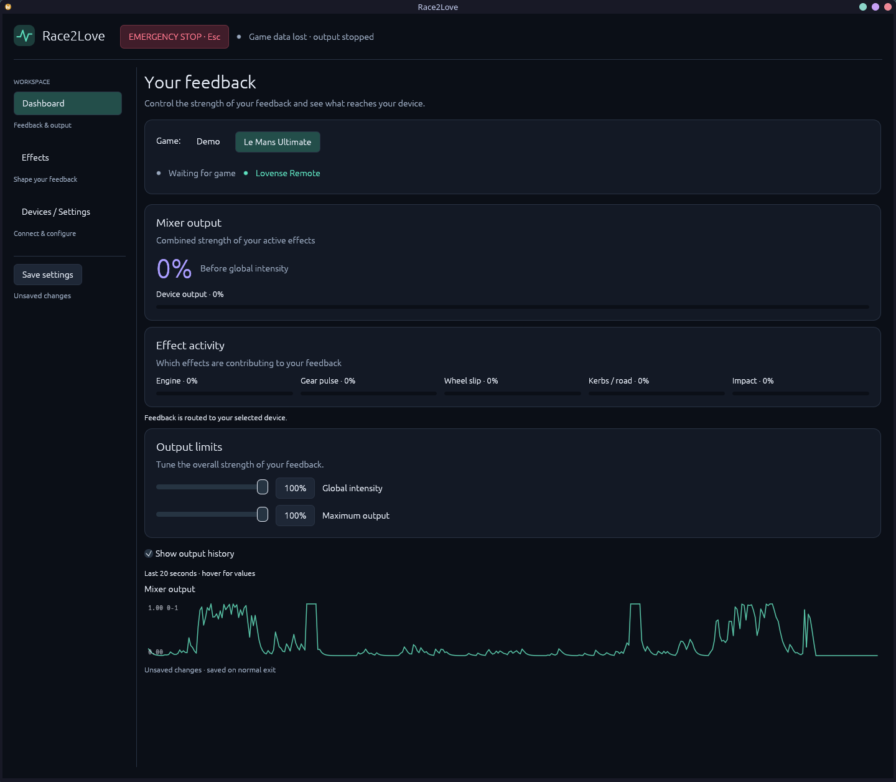
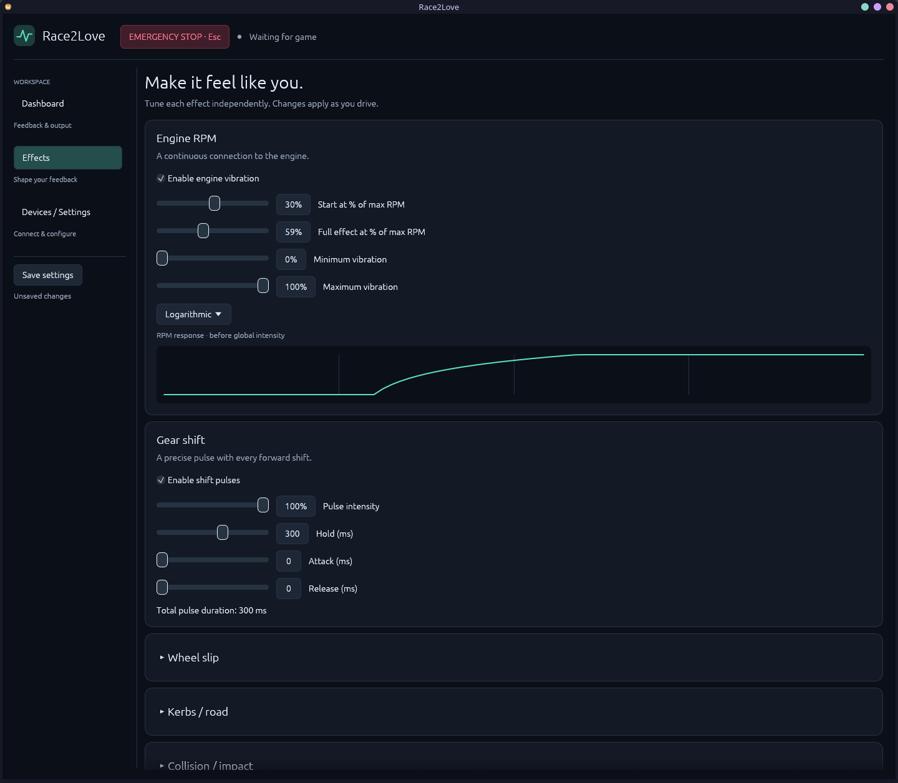

<div align="center">

<a href="https://commons.wikimedia.org/wiki/File:24h_N%C3%BCrburgring_2014_-_Night_Impression.jpg"></a>


The bundled mark is used consistently in the native window, desktop launcher, and
in-app header.

# Race2Love

### Racing telemetry, translated into touch.

<p>Native Rust haptics for <strong>Le Mans Ultimate</strong> and Lovense devices.<br>
Low latency. Local first. Built for Linux + Proton and Windows.</p>

<a href="#quick-start">Quick start</a> ·
<a href="#what-it-does">What it does</a> ·
<a href="docs/INSTALL.md">Install guide</a> ·
<a href="docs/VALIDATION.md">Validation</a>

<br><br>


</div>

Race2Love is a lightweight desktop application that turns racing signals into
configurable, physical feedback. It reads LMU telemetry directly, maps it through
independent effects and a priority mixer, then sends one safe normalized output to
Lovense Remote/Game Mode. There is no SimHub dependency, browser frontend,
Electron shell or mandatory cloud service.

<div align="center">

**LMU → normalized telemetry → effects → mixer → Lovense**

</div>

## Quick start

### Try it without LMU or hardware

Install Rust stable **1.92 or later**, then run the built-in Demo mode:

```sh
cargo run --locked -- --demo
```

For a display-free pipeline smoke test:

```sh
cargo run --locked -- --demo-seconds 5
```

The Demo source ramps RPM, shifts gears and produces slip, road and impact events.
The mock device keeps the whole pipeline safe to develop without a connected toy.

### Connect real hardware

1. Start Lovense Remote and enable **Game Mode**.
2. Open Race2Love → **Devices / Settings**, set the Remote host and port, then
   **Connect** and select a toy.
3. Choose **LMU** on the Dashboard, enter a driving session and click **Resume
   output**. The global Stop button and `Esc` always provide an immediate stop.

See [the installation guide](docs/INSTALL.md) for platform dependencies,
configuration paths and troubleshooting.

## What it does

| Signal | Feedback | Control |
| --- | --- | --- |
| Engine RPM | Continuous vibration with linear, exponential or logarithmic response | Start/end thresholds, min/max intensity |
| Gear changes | Short pulse with envelope shaping | Intensity, duration, attack/release |
| Wheel slip | Smoothed grip-loss feedback | Threshold, gain, ceiling |
| Road / kerb movement | Suspension and acceleration response | Threshold, intensity, debug graph |
| Impacts | Significant acceleration events | Threshold, intensity, cooldown |

The output is clamped, globally scaled and rate-limited before it reaches the
device. Telemetry loss, game exit, Remote disconnect, emergency stop and normal
shutdown all stop output safely.

## Product surface

- **Dashboard** keeps attention on connection state, effect activity, mixer output
  and device output. Driving telemetry is available in Debug mode when tuning.
- **Effects** exposes focused controls and a live RPM response preview.
- **Devices / Settings** handles Lovense connection, toy selection, test vibration,
  reconnect policy, profiles, logging and configuration.
- **Debug mode** reveals raw telemetry, bounded graphs and runtime diagnostics when
  you need to investigate a track or telemetry adapter.

Release readiness includes reproducible Linux and Windows packages, checksums,
CI artifacts and dependency notices. Read the [roadmap](docs/ROADMAP.md) and
[validation record](docs/VALIDATION.md) for the current status.

> Banner image: [“24h Nürburgring 2014 – Night Impression”](https://commons.wikimedia.org/wiki/File:24h_N%C3%BCrburgring_2014_-_Night_Impression.jpg)
> by [Marc Strauch](https://www.flickr.com/photos/m_strauch/15029863914), used under
> [CC BY 2.0](https://creativecommons.org/licenses/by/2.0/). Cropped for the
> README banner. Race2Love is an independent telemetry companion.

## Screenshots

The application UI is native `egui` and is best viewed at its normal desktop
size. These captures show the feedback-first Dashboard and the effect tuning
workspace:

<div align="center">




</div>

## Linux setup

On CachyOS / Arch, install the build tools and native display libraries:

```sh
sudo pacman -S --needed base-devel pkgconf libx11 libxcb libxkbcommon wayland mesa
cargo build --locked --release
./target/release/race2love --demo
```

Use your GPU vendor's normal OpenGL driver if you do not use Mesa. A normal
desktop session is required for the GUI; the display-free smoke run does not
open a window. On Debian/Ubuntu, corresponding packages include `build-essential`,
`pkg-config`, `libx11-dev`, `libxcb-render0-dev`, `libxcb-shape0-dev`,
`libxcb-xfixes0-dev`, `libxkbcommon-dev`, `libwayland-dev`, and `libgl1-mesa-dev`.
The [upstream eframe setup guide](https://github.com/emilk/eframe_template#testing-locally)
provides further distribution notes.

Game reading and application use must run as the same user; Race2Love is not
intended to run as root. Installing OS build packages is a separate setup step.

## Windows setup

Install Rust stable using rustup with the default MSVC target. Install Visual
Studio Build Tools with **Desktop development with C++** and the Windows SDK.
From PowerShell:

```powershell
cargo build --locked --release
.\target\release\race2love.exe --demo
```

The release executable uses the Windows GUI subsystem. No administrator access
is needed to run the application. Debug builds retain the console for logging.
The TLS crypto provider needs the C/C++ compiler supplied by those Build Tools.
The complete workspace also passes a Windows GNU target check from Linux using
Clang with the validation-only flags recorded in [VALIDATION.md](docs/VALIDATION.md).
Normal Windows GNU builds use MinGW. Native MSVC build/runtime validation remains.

## Build and package both releases from Linux

From x86-64 Linux, run this one command (Python 3.11 or later is required):

```sh
python3 tools/build-release.py
```

It builds optimized Linux and Windows x64 executables with stripped symbols and
thin LTO, then creates these files in `dist/`:

- `Race2Love-0.1.0-linux-x86_64.tar.gz`
- `Race2Love-0.1.0-windows-x86_64.zip`
- `SHA256SUMS.txt`

Each archive contains just the executable, launch instructions, example settings,
license file and build information. Windows also includes LMU and log launchers.
Send the archives, rather than `target/`: Cargo keeps dependencies, intermediate
files and debug builds there, which can take hundreds of MB. Without `--release`,
`cargo build --target ...` produces a larger debug executable.

One-time cross-compilation setup, in addition to the Linux dependencies above:

```sh
rustup target add x86_64-pc-windows-gnu
# CachyOS / Arch:
sudo pacman -S --needed mingw-w64-gcc mingw-w64-binutils
# Debian / Ubuntu alternative:
# sudo apt-get install gcc-mingw-w64-x86-64 binutils-mingw-w64-x86-64
```

The script selects the MinGW linker and C compiler automatically. Existing
`CARGO_TARGET_DIR` and compiler environment overrides are respected. Use
`--offline` to build from cached dependencies, or `--output-dir PATH` to choose
the archive directory. Subsequent runs reuse Cargo's build cache.
Linux packages use the build host's glibc and desktop libraries; build on your
oldest supported Linux distribution if you need broader compatibility.

## Architecture

```text
TelemetrySource (Demo or direct Windows/Proton LMU)
    ↓ TelemetryFrame (SI units; optional signals)
independent effect generators
    ↓ continuous effects + transient envelopes
EffectMixer (bounded, priority-aware)
    ↓ normalized mixed intensity
global intensity multiplier + absolute maximum
    ↓ watch channel + rate/duplicate gate + watchdog
HapticDevice (MockDevice or local Lovense Remote)
```

The workspace has an executable plus four library crates:

```text
Cargo.toml
src/main.rs                       # logging, configuration, runtime lifetime
crates/race2love-core/src/
  config.rs                       # defaults, validation, TOML, config path
  telemetry/                      # normalized frames, source trait, Demo/mock
  effects.rs                      # RPM curves, shift detector, effect engine
  mixer.rs                        # transient envelopes and priority mixing
  devices.rs                      # device trait and bounded in-memory mock
  runtime.rs                      # telemetry/effects/output tasks and controls
crates/race2love-lovense/src/       # typed protocol and local connection worker
crates/race2love-lmu/src/           # shared decoder/freshness, Windows mappings, Linux /proc
crates/race2love-gui/src/lib.rs     # native eframe/egui views
docs/                             # adapter plans and validation record
```

The core contains no LMU layouts or Lovense protocol fields. Telemetry discovery
and reads run in a dedicated blocking worker; effects and output run on a
two-worker Tokio runtime. The
GUI reads snapshots and sends settings/controls through latest-value `watch`
channels; it makes no network requests. Lovense discovery and commands run in
a separate connection worker. See [architecture details](docs/ARCHITECTURE.md).

## Effects and timing

RPM uses `rpm / max_rpm`, maps the configured start/end window through the selected
curve, then interpolates the minimum/maximum vibration. Exponential is `x²`;
logarithmic is `log10(1 + 9x)`. Invalid RPM/max RPM produces zero output.

An adjacent forward gear change creates an attack/hold/release pulse. Neutral,
reverse, first samples, skipped gears, and reconnect/reset samples do not trigger
normal shift pulses. Engine priority is 20 and shift priority is 160.

The mixer combines priority layers using a bounded soft sum, preserving the
engine background throughout higher-priority pulse envelopes. A pulse cannot
reduce existing engine vibration simply by becoming active. Single-effect levels
also retain their precision at device step boundaries. At most 16 transient effects
are retained. The global multiplier applies **after mixing**, followed by an
independent absolute intensity ceiling. All output is normalized to `0..=1`.

Defaults are **60 Hz telemetry**, **60 Hz effects**, **25 Hz device output**, and
**30 Hz GUI refresh**. Mock output uses 1% steps. Lovense defaults to the working
Direct Vibrate mode. Experimental Pattern modes
retain fractional native targets and optionally dither using 110 ms slots. They
coalesce small changes until the previous slot can play, explicitly cancel earlier
schedules before replacement, and send sharp changes through direct Vibrate.
Every emitted level respects the absolute ceiling.
See [the output comparison](docs/LOVENSE.md#smoother-output-and-comparison) for timing,
tradeoffs and A/B instructions. Duplicates are suppressed, except for required Lovense
lease renewal every 500 ms. Stops bypass the positive-output rate limit. Paused
or unavailable telemetry polls at 1 Hz and inactive effect/UI timers use 2 Hz. These are starting
choices, not measured latency/CPU guarantees. Lovense commands expire after two seconds without renewal. Hardware timing
and CPU/latency still require measurement.

Demo simulates a 24-second driving cycle with RPM ramps, up/downshifts, braking,
slip, kerbs, and occasional explicit impacts. Enable the additional effects in
Effects to try them; they default off. Dashboard offers optional 20-second live
output history and effect meters. Debug mode adds telemetry graphs and a shift
counter. Demo and LMU use the same effect engine.

## Configuration and logging

Default config locations:

- Linux: `$XDG_CONFIG_HOME/race2love/config.toml`, or
  `~/.config/race2love/config.toml` when XDG is unset/relative.
- Windows: `%APPDATA%\race2love\config.toml`.

Set `RACE2LOVE_CONFIG` to override the file location. Missing files use defaults;
invalid files are reported and preserved until an explicit save or a changed
settings save on exit. Writes stage a temporary file in the same directory before
replacement. TOML stores preferences, never active sessions, telemetry frames,
emergency-stop state, or detected devices. [Example config](config.example.toml)
shows all current fields. Lovense protocol is `http` or `https`; HTTPS verifies
certificates. Toy selection and connection state are not persisted.

`RUST_LOG` controls tracing. The default logs connections, configuration activity,
and failures rather than every frame:

```sh
RUST_LOG=race2love_core=debug cargo run -- --demo
```

## Safety

The runtime stops on emergency stop, source pause/disconnection, missing/stale
telemetry (250 ms by default), effects worker failure/stalled heartbeat, and normal
application shutdown. These are bounded output stops; a transient Lovense Remote
or toy disconnect is retried automatically and does not latch the UI into a
manual Resume state. Commands and stops have bounded timeouts.

Lovense output always targets one explicitly selected toy. Positive commands use
`timeSec = 2`, `stopPrevious = 1`, and a 500 ms renewal interval. Zero intensity
sends Stop. Source/device switches stop previous output. Lovense connection retries
use bounded backoff (up to five attempts), then remain visible as an error until
the user reconnects. Choose the Emergency Stop key in Devices / Settings; Esc, F8,
F9, F10 and Disabled are available.

The one-second manual Test intentionally works without game telemetry, pauses
Demo, and respects emergency stop and both intensity limits. It leaves Demo
paused when it ends. Enable Demo again to use racing effects.

A crash, power loss, or unreachable Remote can prevent a final network Stop.
Finite command expiry bounds remaining output under the documented Remote API.
This behavior is verified against a fake Remote. The owner reports successful
physical testing; toy/Remote versions and detailed fault checks were not recorded.
See [Lovense details](docs/LOVENSE.md).

## LMU telemetry

LMU provides a native shared-memory interface. Race2Love uses `LMU_Data` directly
and normalizes samples at the adapter boundary, without SimHub or a third-party DLL.
LMU's [official V1.3 announcement](https://lemansultimate.com/le-mans-ultimate-releases-v1-3-update-with-final-elms-content-performance-updates/)
confirms that the shared-memory telemetry interface is evolving.

On **Windows**, enable **Settings → Gameplay → Enable Plugins** in LMU and restart
the game. Select **Le Mans Ultimate** on Dashboard, or launch `race2love.exe --lmu`.
Enter the car in a driving session. The adapter opens read-only telemetry and uses
the SDK lock to copy bounded snapshots; it validates the known 1.2–1.4 layout,
selects the player, and exposes RPM/max RPM, gear, speed, throttle and brake.
Frozen clocks cannot refresh output. Game exit is detected via a process handle;
non-realtime/player exit clears output. Snapshots poll under the SDK lock; frame
notification events are left untouched so they cannot starve the reader. See [LMU.md](docs/LMU.md) for the verified installed layout, sources and
remaining live Windows acceptance.

On **Linux/Proton**, enable Plugins and restart LMU, then select **Le Mans
Ultimate** or run `race2love --lmu`. Race2Love finds the same user's game and
associated `PluginsAdapter.exe` dynamically, validates Wine's shared-memory
backing files through `/proc/<pid>/fd/<n>`, and reuses the Windows decoder. No
Steam library path, Proton version, root privileges or bridge is required.
Reads are read-only and bounded; changed processes/descriptors, truncation and
frozen clocks stop output and trigger rediscovery.

Linux uses two matching reads of the fields it consumes, rather than the Windows
SDK lock: `/proc` does not expose Wine's named synchronization objects. This
reduces torn reads but cannot guarantee a fully atomic producer transaction.
`/proc` restrictions, different users, sandbox boundaries, or Wine builds that do
not expose a supported backing descriptor can prevent access. These conditions
appear on Dashboard and leave output stopped. See [LMU.md](docs/LMU.md) for exact
heuristics, synchronization limits, reference licenses and test status.
Wheel slip uses the SDK sliding contact-patch fraction. Road feedback combines
suspension travel speed, high-pass vertical acceleration and explicit rumble-strip
contact when provided. Some LMU tracks leave that flag false, so road feedback
does not depend on it. Impact pulses require a new game-reported impact event.
These effects are opt-in; [signal definitions and tuning](docs/EFFECTS.md) explain
their limitations and sensitivity controls.

## Lovense setup

1. Pair your toy in Lovense Remote.
2. On mobile, open **Discover → Game Mode → Enable LAN**. On PC, enable
   **Allow Control**.
3. In Devices / Settings, enter Remote's host/IP, port, and HTTP/HTTPS protocol.
   The **Local HTTP preset** fills `127.0.0.1:20010`; confirm your Remote's port.
   The documented PC HTTPS endpoint is `127-0-0-1.lovense.club:30010`.
4. Click **Connect / Discover toys**, then select one connected toy. These actions
   latch emergency stop and send Stop before enabling the backend.
5. Pause Demo on Dashboard, click **Resume output**, then use **Test vibration**.
   The test lasts one second at 40% × global intensity, capped by maximum intensity.
6. Enable Demo to run the RPM/shift pipeline with synthetic telemetry. Use
   **Emergency Stop** at any time. **Disconnect / Use mock output** stops the toy
   and returns to mock output with emergency stop latched.

Mobile setup and the HTTP preset follow the [official Game Mode demo](https://developer.lovense.com/standard-api-demo-game-mode).
PC setup is described in the [Remote integration guide](https://developer.lovense.com/docs/game-engine-plugins/ue-plugin-remote)
and [Standard API](https://developer.lovense.com/docs/standard-solutions/standard-api).
For LAN operation, keep Race2Love and Remote on the same network. Linux can use
mobile Remote over LAN. HTTPS requires the certificate's valid hostname; raw IP
addresses may fail verification. Certificate verification is never disabled.

Discovery asks the configured Remote for its toys. There is no automatic LAN
scan, QR/cloud discovery, developer token, or auto-connect on launch. Reconnects
use bounded backoff and resume output automatically after a transient toy or
Remote restart. Endpoint errors appear in the GUI and technical details are logged.

## Development checks and next phase

```sh
cargo fmt --all --check
cargo check --workspace --all-targets --locked
cargo clippy --workspace --all-targets --locked -- -D warnings
cargo test --workspace --locked
```

All **74 Linux tests** pass: 31 core, three GUI, 15 LMU (including nine Linux
acquisition tests), six Lovense shaping/backoff tests,
and 19 fake Remote tests. Four additional Windows-only mapping/process fixtures
compile here and run under an isolated Wine prefix; native Windows CI is also
configured (69 Windows tests in total). Tests cover effect logic,
configuration, pipeline safety, GUI controls, typed discovery, targeted request
bodies, bounded responses/timeouts, finite expiry, renewal/deduplication,
selection changes, manual-test limits, cancellation, reconnect, toy loss,
persistent Stop failures, and shutdown. The Phase 5 integration test checks live
RPM curves, up/downshift pulses, scaling/ceiling changes and telemetry loss during
a held pulse through the real Lovense backend with a loopback fake Remote.
Linux tests cover process/prefix discovery,
PID/fd reuse, memfd reads, truncation, inconsistent snapshots and recovery. No real
LMU or toy is required.

`Cargo.lock` is included. See [validation results](docs/VALIDATION.md) for native
Linux and platform compile checks. GitHub CI checks Linux and native Windows/MSVC
on push and pull requests; the new workflow has not run in this local session.

**Next acceptance step:** tune the road vibration threshold/gain against actual
kerbs and ordinary tarmac on your tracks. Use Dashboard debug and graphs, then
save effects in a named profile. The latest fallback is regression-tested; its
physical feel still needs confirmation. Gear shifts now bridge brief neutral
samples (up to 250 ms), with a visible shift counter for diagnosis.

Known limits: native MSVC build validation and native Wayland runtime checks
remain; broader Windows/Lovense fault acceptance is unrecorded. Road vibration
also responds to bumps/grass and is not a kerb classifier. Impact severity is an
acceleration estimate. Tray and autostart are not implemented. CPU usage and
end-to-end latency have not been benchmarked.

## License

Race2Love is source-available under the [PolyForm Noncommercial License
1.0.0](LICENSE). Commercial use, including resale, is not permitted by that
license. Redistributed copies must retain [NOTICE](NOTICE), the license text and
the relevant third-party notices. The project name and attribution are
**Race2Love**; no UI credit is required by the license.
