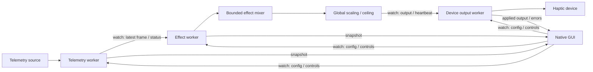

# Core and adapter boundaries

`race2love-core` owns normalized telemetry, preferences, independent generators,
mixing, output safety, and worker orchestration. `race2love-gui` owns native views.
`src/main.rs` owns logging, config loading, the two-thread Tokio executor, and the
awaited shutdown after the desktop event loop returns.

`TelemetrySource` is an object-safe, synchronous `Send` interface. It performs a
bounded read in the telemetry worker and returns `None` for no fresh sample.
Reads must retain the original observation timestamp when data does not advance.
An adapter must report game closure as disconnection and must keep expensive
process discovery off Tokio workers, using a blocking worker/thread when needed.

`TelemetryFrame` contains SI values and optional source-qualified signals. Wheel
order is FL, FR, RL, RR. Session/car strings are owned, so no raw game-memory
references escape the adapter. Unknown values remain `None`; raw LMU structs are
never an input to a generator or a device backend.

`HapticDevice` is an object-safe `Send + Sync` interface with boxed futures for
`set_vibration` and `stop`. This uses the standard library without async-trait.
Intensity is `0..=1`; conversion to device integer steps belongs in each backend.
Phase 1's mock stores only an atomic current intensity, connection bit, and two
counters. It never accumulates command history.

## Tasks and channels

Watch channels replace old values instead of accumulating a backlog. There is no
mutex-protected queue of telemetry frames. Every adapter has a separate worker
from rendering and output. The GUI only snapshots channel values and sends new
settings/controls; config file saves are small explicit/exit writes.

Defaults: source polling 60 Hz, envelope timer 60 Hz, output cap 25 Hz, GUI 30 Hz.
Fresh telemetry/settings can wake effects before the next timer tick. Output
positive requests still obey the configured cap. Timers skip missed ticks rather
than issuing catch-up bursts. Source-disabled polling drops to 1 Hz; inactive
effects and UI repaint timers use 2 Hz. Device status/watchdog checks continue
independently from the GUI.

At most 16 transients remain active. Each has intensity, priority, attack, hold,
release and a private start time. Expired envelopes are removed each sample.
When capacity is full, a new equal/higher priority transient replaces a lowest
priority transient; a lower priority incoming effect is rejected.

For each active effect, weight is
`1 / (1 + (highest_active_priority - priority) / 64)`.
The mixer computes `1 - product(1 - intensity * weight)`. Effects at the highest
priority retain full strength; others are attenuated. The result is clamped,
multiplied by global intensity, then capped by maximum intensity. Non-finite
values fail closed to zero. The current output gate rounds downward to 1% steps
to avoid rounding above an arbitrary safety ceiling.

## Stop and fault handling

Global Stop is a latched control channel value. Configuration changes and source
reconnects cannot undo it. Only explicit Resume clears it. The effect worker
resets shift history and envelopes while stopped or stale, so an old shift cannot
replay when driving resumes.

The device worker checks controls, current telemetry age, effects heartbeat,
connection state, and output ceiling independently. Emergency/source control
changes can cancel an in-flight positive request; a stop follows cancellation.
Stops bypass positive-output throttling. Cancellation of an HTTP future does not
prove that Remote did not already receive its command; the Phase 2 lease/Stop
protocol must cover that case.

Before initial output, on connection transitions, and on shutdown, the worker
attempts a timeout-bounded stop. A communication failure latches output off,
attempts one best-effort stop, and suppresses automatic output retries until
explicit Stop/Resume. It records a human-readable error and logs the failure.
Shutdown signals all workers, disconnects the source, and awaits the final stop.

Hardware backends must add finite command leases and periodic renewal for
unchanged positive intensities. Lease renewals are necessary commands and must
bypass duplicate suppression while retaining the request rate cap. Backend toy
status polling/reconnect belongs outside the GUI and must use bounded retries.

## Future modules

Phase 2 adds `race2love-lovense`, implementing `HapticDevice` and connection/toy
discovery. Phase 3 adds `race2love-lmu`, implementing `TelemetrySource`. Its parser
is shared between Windows and Linux; only acquiring/reading shared memory differs
by platform. Unsafe code, if needed for mappings, belongs in a narrow documented
adapter, with crate-specific lint policy. Core/GUI currently forbid unsafe code.

Phase 6 adds generators for verified slip/road/impact signals and bounded rolling
graphs. It does not introduce those algorithms into the telemetry adapter or
Lovense backend. There are no unused adapter stub crates or unimplemented methods
in the current workspace.
