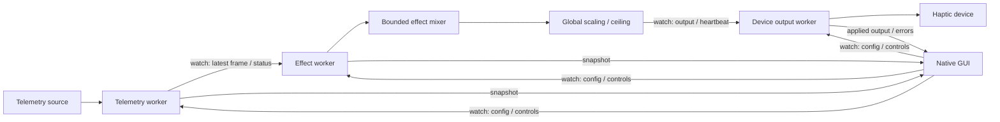

# Core and adapter boundaries

`race2love-core` owns normalized telemetry, preferences, independent generators,
mixing, output safety, and worker orchestration. `race2love-gui` owns native views.
`race2love-lovense` owns local HTTP protocol, discovery, selection, and reconnect.
`race2love-lmu` owns the safe native byte decoder, Windows SDK mapping access and
read-only Linux/Proton acquisition through `/proc`.
`src/main.rs` owns logging, config loading, the two-thread Tokio executor, and the
awaited shutdown after the desktop event loop returns.

`TelemetrySource` is an object-safe, synchronous `Send` interface. It performs a
bounded read in the telemetry worker and returns `None` for no fresh sample.
Reads must retain the original observation timestamp when data does not advance.
An adapter must report game closure as disconnection and must keep expensive
process discovery off the async executor. The telemetry task runs in a dedicated
Tokio blocking worker, using async channel/timer waits between reads. A `Waiting`
error clears old player data without closing a still-valid game connection.

`TelemetryFrame` contains SI values and optional source-qualified signals. Wheel
order is FL, FR, RL, RR. Session/car strings are owned, so no raw game-memory
references escape the adapter. Unknown values remain `None`; raw LMU structs are
never an input to a generator or a device backend.

`HapticDevice` is an object-safe `Send + Sync` interface with boxed futures for
`set_vibration` and `stop`. This uses the standard library without async-trait.
Intensity is `0..=1`; conversion to device integer steps belongs in each backend.
The mock stores only an atomic current intensity, connection bit, and two
counters. It never accumulates command history.

## Tasks and channels

Watch channels replace old values instead of accumulating a backlog. There is no
mutex-protected queue of telemetry frames. Every adapter has a separate worker
from rendering and output. The GUI only snapshots channel values and sends new
settings/controls; config file saves are small explicit/exit writes.

Defaults: source polling 60 Hz, envelope timer 60 Hz, output cap 25 Hz, GUI 30 Hz.
Fresh telemetry/settings can wake effects before the next timer tick. Output
positive requests still obey the configured cap. Timers skip missed ticks rather
than issuing catch-up bursts. Disabled/disconnected/waiting sources poll at 1 Hz; inactive
effects and UI repaint timers use 2 Hz. Device status/watchdog checks continue
independently from the GUI.

At most 16 transients remain active. Each has intensity, priority, attack, hold,
release and a private start time. Expired envelopes are removed each sample.
When capacity is full, a new equal/higher priority transient replaces a lowest
priority transient; a lower priority incoming effect is rejected.

For each active effect, weight is
`1 / (1 + (highest_active_priority - priority) / 64)`.
The mixer computes `1 - product(1 - intensity * weight)`. Effects at the highest
priority retain full strength; others are attenuated. The result is clamped,
multiplied by global intensity, then capped by maximum intensity. Non-finite
values fail closed to zero. Each backend supplies downward quantization: 1% for the mock and 5% for Lovense.
The gate compares the quantized result. Backends can request a refresh interval;
Lovense renews unchanged positive output at 500 ms within the output rate cap.

## Stop and fault handling

Global Stop is a latched control channel value. Configuration changes and source
reconnects cannot undo it. Only explicit Resume clears it. The effect worker
resets shift history and envelopes while stopped or stale, so an old shift cannot
replay when driving resumes.

The device worker checks controls, current telemetry age, effects heartbeat,
connection state, and output ceiling independently. Emergency/source control
changes can cancel an in-flight positive request; a stop follows cancellation.
Stops bypass positive-output throttling. Cancellation of an HTTP future does not
prove that Remote did not already receive its command; the Lovense worker follows
canceled positive requests with Stop and uses two-second finite command leases.

Before initial output, on connection transitions, and on shutdown, the worker
attempts a timeout-bounded stop. A communication failure latches output off,
attempts one best-effort stop, and suppresses automatic output retries until
explicit Stop/Resume. It records a human-readable error and logs the failure.
Shutdown signals all workers, disconnects the source, and awaits the final stop.

Runtime device selection is a watch channel. Selection latches emergency stop,
and the output worker stops the previous backend before accepting the replacement.
A backend connection epoch detects reconnect/selection transitions even if they
complete between output samples. Physical backend transitions latch emergency
stop and require explicit Resume. Failed Stops do not repeatedly change epochs.

Telemetry selection is a latest-value factory channel; construction/connection
occurs in the telemetry worker. Switching disconnects the old source, clears its
frame and latches Stop. Controls, frames and effects carry a source generation,
preventing old-source output even with an immediate Resume before worker handoff.
Unavailable discovery retries once per second; identical waiting/discovery errors
are not logged each tick. Reconnecting cannot refresh a frozen LMU sample.

Manual Test is a bounded one-second control deadline, independent of telemetry.
It pauses telemetry and passes through global scaling and the ceiling. Emergency stop,
backend changes, timeout, and shutdown cancel it. It cannot clear emergency stop.

The Lovense worker serializes positive commands and selection/Stop operations via
an eight-entry request channel, with oneshot acknowledgements. Configuration and
selection use a watch channel. A canceled acknowledgement cancels the HTTP future
and sends Stop. Status discovery can remain pending while commands/Stop are
handled, avoiding both head-of-line blocking and discovery starvation. HTTP bodies
are capped at 64 KiB; all requests have timeouts. No background requests occur
until explicit Connect. Healthy discovery polls every two seconds; connection
failure uses at most five retries at 1/2/4/8/16 seconds. Toy selection is transient.

## Simulator adapter and future modules

Phase 2 implements `race2love-lovense`; see [protocol and safety details](LOVENSE.md).
Phase 3 implements `race2love-lmu`. `SnapshotReader` isolates acquisition;
`LmuSource<R>` handles parsing/freshness once for Windows and Proton readers.
Only the Windows module permits unsafe code, with documented invariants. Core/GUI
forbid unsafe code. See [LMU.md](LMU.md) for packing, offsets, locking, version limits
and live acceptance work. Phase 4 implements read-only Proton acquisition through
`/proc`, with process/fd identity checks and repeated field reads; the Linux module
uses only safe standard-library I/O.

Phase 6 adds generators for verified slip/road/impact signals and bounded rolling
graphs. It does not introduce those algorithms into the telemetry adapter or
Lovense backend. LMU is selectable on Windows and Linux; other platforms retain
Demo and report native acquisition as unavailable.
